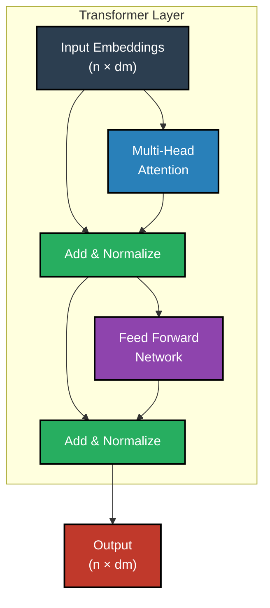
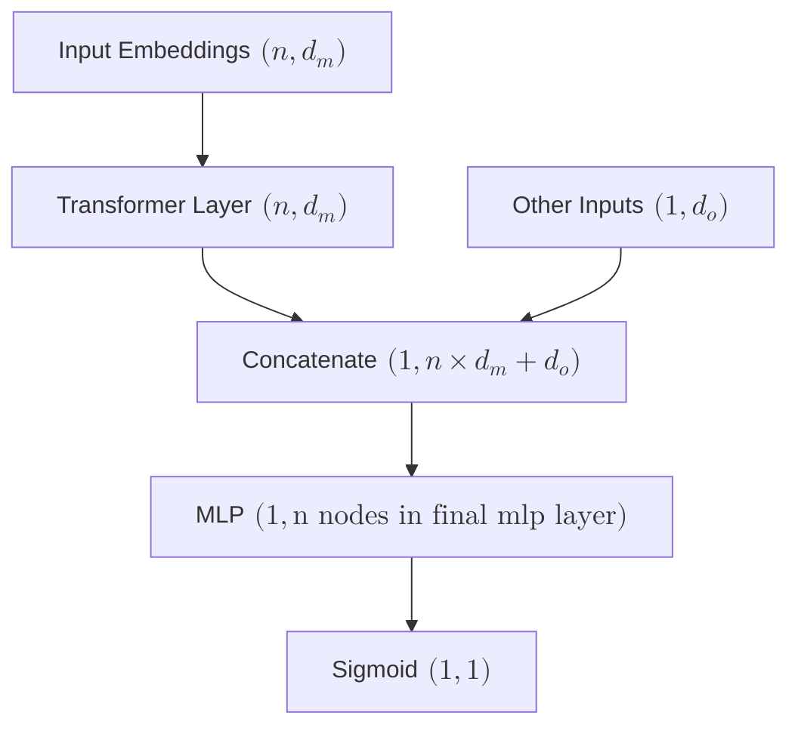

# Behavioural Sequence Transformers and Attention in E-commerce

## Introduction and Motivation

Exploring the application of paper [Behavior Sequence Transformer for E-commerce Recommendation in Alibaba](https://arxiv.org/pdf/1905.06874).

The key innovation is adapting the Transformer's attention mechanism to model sequential user behavior for better product recommendations.

### Key Concepts
- **Sequential Behavior**: Users interact with products in a sequence (clicks, purchases, etc.)
- **Attention Mechanism**: Helps identify which past interactions are most relevant for predicting future interests
- **Embedding Space**: Products are represented in a shared space where similar items are closer together

## Vocabulary and Embeddings

We start with a vocabulary of size $|V|$, where each element represents a unique item (product, restaurant, etc.) in our e-commerce system. The goal is to learn meaningful representations of these items that capture both their inherent properties and their role in user behavior sequences.

### Item Embedding Matrix

The embedding matrix $W \in \mathbb{R}^{|V| \times d_m}$ maps from one-hot encoded items to dense embedding vectors:
- Input dimension: $|V|$ (vocabulary size)
- Output dimension: $d_m$ (embedding dimension)
- Each row $v^i$ represents the embedding weights for item $i$

$$
W = \begin{pmatrix}
- & v^1 & - & \quad \text{item 1 embedding weights} \\
- & v^2 & - & \quad \text{item 2 embedding weights} \\
& \vdots & \\
- & v^{|V|} & - & \quad \text{item |V| embedding weights}
\end{pmatrix} \quad \in \mathbb{R}^{|V| \times d_m}
$$

### Computing Item Embeddings

For any item $i$, represented as a one-hot vector $v^i = (0,...,1,...,0) \in \mathbb{R}^{|V|}$, its embedding $e^i$ is computed as:

$$
\begin{aligned}
e^i = v^i W \quad \text{where} \quad (1, d_m) = (1, |V|) \ @ \ (|V|, d_m)
\end{aligned}
$$

This matrix multiplication effectively selects the $i$-th row of $W$ as the item's embedding vector.
## Sequence Modeling

### Sequence Embedding Matrix

For a user's interaction sequence of length $n$, we construct a sequence embedding matrix $E \in \mathbb{R}^{n \times d_m}$:
- Each row $e_t$ is the embedding of the item at position $t$ in the sequence
- The subscript $t$ indicates temporal position (unlike superscript $i$ which indicated vocabulary index)
- Shape $(n, d_m)$ where $n$ is sequence length and $d_m$ is embedding dimension

$$
\begin{aligned}
E = \begin{pmatrix}
- & e_1 & - & \quad \text{first item embedding} \\
- & e_2 & - & \quad \text{second item embedding} \\
& \vdots & \\
- & e_n & - & \quad \text{last item embedding}
\end{pmatrix} \quad \in \mathbb{R}^{n \times d_m}
\end{aligned}
$$
### Positional Encoding

To incorporate sequential order information, we add positional encodings to the embeddings. These encodings are designed to:
- Provide unique position information for each timestep
- Allow the model to learn relative positions
- Maintain consistent magnitude across different positions

In the original [Attention is all you need paper](https://arxiv.org/pdf/1706.03762) the positional encoding for position $pos$ and dimension $i$ is computed as:

$$
\begin{aligned}
PE(pos, 2i) &= \sin(pos/10000^{2i/d}) & \text{for even dimensions} \\
PE(pos, 2i+1) &= \cos(pos/10000^{2i/d}) & \text{for odd dimensions}
\end{aligned}
$$

This creates a positional encoding matrix $PE \in \mathbb{R}^{n \times d_m}$:

$$
\begin{aligned}
PE = \begin{pmatrix}
- & pe_1 & - & \quad \text{position 1 encoding} \\
& \vdots & \\
- & pe_n & - & \quad \text{position n encoding}
\end{pmatrix} \quad \in \mathbb{R}^{n \times d_m}
\end{aligned}
$$

The final input to the self-attention layer abusing notation is $E = E + PE$, which combines both item features and position information.

Note in the BST paper rather than using the sinusoidal positional encoding they use a learned positional encoding based on $pos(e_i) = t(v_t) - t(v_i)$ where $t(v_t)$ is the recommendation time and $t(v_i)$ is the item click time.

## Self-Attention Mechanism

### Query and Key Projections

The self-attention mechanism uses three types of projections: Queries, Keys, and Values. Each serves a specific purpose:
- **Queries**: What the current item is looking for
- **Keys**: What each item has to offer
- **Values**: The actual information to be aggregated

First, let's look at the Query and Key projections:

- $W^Q \in \mathbb{R}^{d_m \times d_k}$: Projects embeddings into "query" space
- $W^K \in \mathbb{R}^{d_m \times d_k}$: Projects embeddings into "key" space
- $d_k$: Dimension of the query/key space (typically smaller than $d_m$)

$$
\begin{aligned}
\underbrace{
\begin{pmatrix}
- & e_1 & - \\
& \vdots & \\
- & e_n & -
\end{pmatrix}
}_{E \ (n, d_m)}
\ @ \
\underbrace{
\begin{pmatrix}
| & & | \\
w_1^Q & \cdots & w_{d_k}^Q \\
| & & |
\end{pmatrix}
}_{W^Q \ (d_m, d_k)}
=
\underbrace{
\begin{pmatrix}
e_1 w_1^Q & \cdots & e_1 w_{d_k}^Q \\
\vdots & & \vdots \\
e_n w_1^Q & \cdots & e_n w_{d_k}^Q
\end{pmatrix}
=
\begin{pmatrix}
- & q_1 & - \\
& \vdots & \\
- & q_n & -
\end{pmatrix}
}_{Q \ (n, d_k)}
\end{aligned}
$$
The rows of $Q$ are the queries for the $n$ items. The columns of $W^Q$ are known as "feature detectors" or "perspective filters".

$$
\begin{aligned}
\underbrace{
\begin{pmatrix}
- & e_1 & - \\
& \vdots & \\
- & e_n & -
\end{pmatrix}
}_{E \ (n, d_m)}
\ @ \
\underbrace{
\begin{pmatrix}
| & & | \\
w_1^K & \cdots & w_{d_k}^K \\
| & & |
\end{pmatrix}
}_{W^K \ (d_m, d_k)}
=
\underbrace{
\begin{pmatrix}
e_1 w_1^K & \cdots & e_1 w_{d_k}^K \\
\vdots & & \vdots \\
e_n w_1^K & \cdots & e_n w_{d_k}^K
\end{pmatrix}
=
\begin{pmatrix}
- & k_1 & - \\
& \vdots & \\
- & k_n & -
\end{pmatrix}
}_{K \ (n, d_k)}
\end{aligned}
$$
The rows of $K$ are the keys for the $n$ items. The columns of $W^K$ are known as "feature signatures" or "contextual labels".

The matrix $W^Q$ projects the original features into a "query" or "seeking" representation, while $W^K$ projects them into a "key" or "offering" representation. These two matrices, $W^Q$ and $W^K$, are learned together so that the model can map features into a shared space: one side formulates questions (queries), and the other provides possible matches (keys). This shared space enables the model to determine how relevant each item is to the others.

The `Query` and `Key` components of attention determine, for each item, which other items it should pay attention to. The `Value` contains the actual information that is shared between items.

Just like Q and K the value vectors are calculated by a projection matrix $W^V$ with shape $(d_m, d_v)$ where $d_v$ is the value dimension.

$$
\begin{aligned}
\underbrace{
\begin{pmatrix}
- & e_1 & - \\
& \vdots & \\
- & e_n & -
\end{pmatrix}
}_{E \ (n, d_m)}
\ @ \
\underbrace{
\begin{pmatrix}
| & & | \\
w_1^V & \cdots & w_{d_v}^V \\
| & & |
\end{pmatrix}
}_{W^V \ (d_m, d_v)}
=
\underbrace{
\begin{pmatrix}
- & v_1 & - \\
& \vdots & \\
- & v_n & -
\end{pmatrix}
}_{V \ (n, d_v)}
\end{aligned}
$$
The rows of $V$ are the values.

Now with Q, K and V
$$
\begin{aligned}
\text{Attention}(Q, K, V) = \text{Softmax}\left(\frac{QK^T}{\sqrt{d_k}}\right)V
\end{aligned}
$$
Note: the Softmax is applied to each row independently. So if $QK_i$ is the ith row of $\frac{QK^T}{\sqrt{d_k}}$ then the softmax is applied to it as
$$
\begin{aligned}
\text{Softmax}(QK_i) = \frac{\exp(QK_i)}{\sum_{j=1}^n \exp(QK_{ij})}
\end{aligned}
$$
where $QK_i$ is the ith row of $\frac{QK^T}{\sqrt{d_k}}$.

## Multi-head self-attention

In multi-head attention:
$$
\begin{aligned}
S = \text{Concat}(\text{head}_1, ..., \text{head}_h)W^H
\end{aligned}
$$
Where $\text{head}_i = \text{Attention}(EW_i^Q, EW_i^K, EW_i^V)$, with shape $(n, d_v)$.
Concatenating the heads to $H = (h_1 | h_2 | ... | h_h)$ results in shape $(n, d_v \times h)$. We then multiply this by $W^H$ of shape $(d_v \times h, d_m)$. S has shape $(n, d_m)$, same as E.

Now S has the new representation of all n embeddings after self attention. A point-wise Feed Forward network is applied. The point-wise means the exact same Feed Forward network is applied to each row of S.

$$
\begin{aligned}
S =
\begin{pmatrix}
-s_1- \\
\vdots \\
-s_n-
\end{pmatrix}
\xrightarrow{then} F = \text{FFN}(S) =
\begin{pmatrix}
\text{FFN}(s_1) \\
\vdots \\
\text{FFN}(s_n)
\end{pmatrix}
\end{aligned}
$$

However in practise the paper actually uses a residual connection to the input embeddings as well as appling a layer norm before the FFN and after the FFN.

$$
\begin{aligned}
S' &= \text{LayerNorm}(E + \text{dropout}(\text{MH}(E))) \\
F &= \text{LayerNorm}(S' + \text{dropout}(\text{LeakyRelu}(S'W^{[1]} + b^{[1]}))W^{[2]} + b^{[2]})
\end{aligned}
$$
where $MH(E) = S$ is the output of the multi-head self-attention layer.

## Architecture Diagrams

### Multi-Head self Attention

The following diagram shows the detailed computation flow in multi-head attention:

```mermaid
graph TD
    E_in["Input Embeddings E<br>(n sequences × d_m dimensions)"]

    subgraph attention["Multi-Head Self Attention"]
            %% Input connections
            E_in --> WQ
            E_in --> WK
            E_in --> WV

            subgraph heads["Attention Head i (i=1..h)"]
                WK(["$$\text{Key Projection } W^K$$"])
                WQ(["$$\text{Query Projection } W^Q$$"])
                WV(["$$\text{Value Projection } W^V$$"])

                %% Improved styling
                style WK fill:#2c3e50,stroke:#000000,stroke-width:3px,color:#ffffff,font-weight:bold
                style WQ fill:#2980b9,stroke:#000000,stroke-width:3px,color:#ffffff,font-weight:bold
                style WV fill:#27ae60,stroke:#000000,stroke-width:3px,color:#ffffff,font-weight:bold

                WK --> Ki["$$\text{Keys } K_i \quad (n × d_k)$$"]
                WQ --> Qi["$$\text{Queries } Q_i \quad (n × d_k)$$"]
                WV --> Vi["$$\text{Values } V_i \quad (n × d_v)$$"]

                Attention["$$\text{Scaled Dot-Product Attention } S = \text{Softmax}\left(\frac{QK^T}{\sqrt{d_k}}\right)V \quad (n × d_v)$$"]
                style Attention fill:#8e44ad,stroke:#000000,stroke-width:2px,color:#ffffff

                Qi --> Attention
                Ki --> Attention
                Vi --> Attention

                Attention --> h_i["$$\text{Head Output } h_i \quad (n × d_v)$$"]
            end

            Concatenate["$$\text{Concatenate } H = [h_1|...|h_h] \quad (n, d_v \times h)$$"]

            OutputProjection(["$$\text{Output Projection } W^H$$"])
            style OutputProjection fill:#c0392b,stroke:#000000,stroke-width:2px,color:#ffffff

            h_i --> Concatenate
            Concatenate --> Output["$$\text{Output } S = H W^H \quad (n, d_m)$$"]
            OutputProjection --> Output
    end
```

### Complete Transformer Layer

The full transformer layer showing the residual connections and normalization:

## Full BST model

The full BST has the sequential click embeddings $E$ as described above that are passed through the transformer layer.
These are then concatenated with other features such as user information and then passed through an MLP and finally to a signmoid to predict the probability of the next item being clicked. Note the final item in the sequence is the item we are seeking a prediction for.

## Summary and Key Points

The Behavioral Sequence Transformer adapts the transformer architecture for e-commerce recommendation by:

1. **Embedding Layer**
   - Maps products to dense vectors
   - Incorporates positional information
   - Preserves sequential behavior patterns

2. **Multi-Head Attention**
   - Captures different types of relationships between items
   - Allows items to attend to relevant past interactions
   - Combines multiple attention perspectives

3. **Feed-Forward Network**
   - Processes attention outputs
   - Adds non-linearity
   - Maintains sequence-level information

4. **Applications**
   - Next item prediction
   - User preference modeling
   - Sequential pattern recognition
   - Personalized recommendations

This architecture effectively models both short-term and long-term dependencies in user behavior sequences, leading to more accurate and contextually relevant recommendations.
